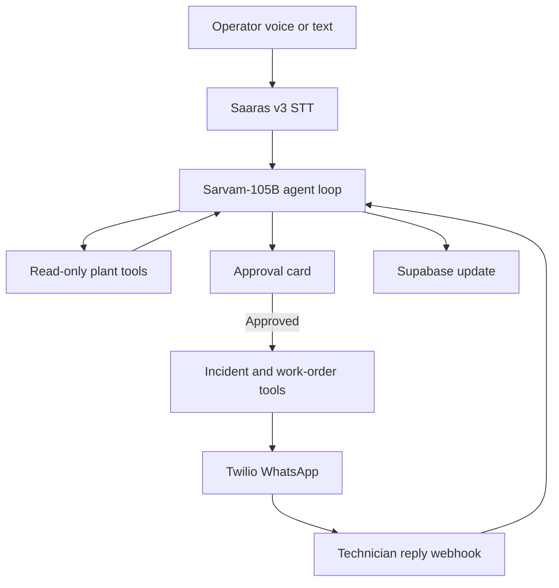

# ChemieGenie — Sarvam Multilingual WhatsApp Incident Agent

## Codex implementation handoff

**Repository:** `https://github.com/varchan123/AIBoomi`  
**Target:** A four-hour, demo-ready extension to the existing ChemieGenie application  
**Primary outcome:** Upgrade ChemieGenie from a RAG copilot into a multilingual agent that investigates plant incidents, proposes external escalation, obtains human approval, sends a real WhatsApp message, interprets the technician's reply, and updates the work order.

---

## 1. Product definition

### Working name

**ChemieGenie Incident Escalation Agent**

### One-sentence pitch

A multilingual plant-floor agent using Sarvam-105B, Saaras v3 and Bulbul v3 that investigates an operator's voice report, creates a grounded escalation plan, sends an approved WhatsApp alert to maintenance, and converts the technician's reply into a structured work-order update.

### Why this is agentic

The model is not used only to produce text. It runs a bounded decision loop in which it can:

1. Identify the relevant machine.
2. Inspect alarms, sensor snapshots and recent incidents.
3. Search historical RCA, SOP and maintenance evidence.
4. Determine whether an escalation is justified.
5. Resolve a recipient from an approved contact registry.
6. Propose incident and work-order writes.
7. Pause for explicit human approval.
8. Create database records after approval.
9. Send a WhatsApp message through an external API.
10. Interpret an inbound WhatsApp reply.
11. Update the work order without inventing facts.

This is a closed loop across the operator, ChemieGenie, Sarvam, Supabase and WhatsApp.

---

## 2. Current repository context

Read these files before changing anything:

- `README.md`
- `app/worker/page.tsx`
- `app/api/triage/route.ts`
- `app/api/ask/route.ts`
- `app/api/incidents/route.ts`
- `lib/openai.ts`
- `lib/retrieval.ts`
- `lib/machineData.ts`
- `lib/prompts.ts`
- `lib/validation.ts`
- `scripts/create_schema.sql`

The existing application already provides:

- OpenAI-generated embeddings and Supabase pgvector retrieval.
- Evidence-grounded breakdown triage.
- Structured incident, alarm, sensor, maintenance, employee and machine data.
- SOP retrieval and machine assets.
- Manual resolved-incident/RCA creation.
- Manager dashboard and fixed-intent plant Q&A.

Preserve those behaviours. Do not rebuild the data layer.

### Important distinction

Keep the existing OpenAI embedding pipeline for this four-hour build. Migrating or regenerating embeddings does not make the product more agentic and risks breaking the existing vector store.

Use Sarvam for:

- New chat/reasoning generation.
- Tool selection and the agent loop.
- Speech-to-text.
- Text-to-speech.
- Interpreting inbound maintenance replies.

---

## 3. Four-hour scope

### Required tonight

- Sarvam API key configured server-side.
- Sarvam-105B tool-calling loop with a hard iteration limit.
- Existing typed triage text still works.
- One approved WhatsApp test recipient.
- Twilio WhatsApp Sandbox sends a real outbound escalation.
- Human approval before any database write or external message.
- Incoming WhatsApp text reply updates `maintenance_actions.status`.
- Worker UI shows the proposed escalation and agent action trace.
- `npm run build` succeeds.

### High-value stretch goal

- Operator records voice in the web app.
- Saaras v3 converts code-mixed speech to text.
- A short Bulbul v3 response is playable in the app.
- Incoming WhatsApp voice note is transcribed by Saaras and converted into an RCA draft.

### Explicit non-goals tonight

- No direct control of plant hardware, DCS, SCADA, PLCs or interlocks.
- No autonomous message sending without approval.
- No production Meta WhatsApp Business registration.
- No multi-tenant authentication.
- No arbitrary SQL generated by the LLM.
- No automatic confirmation of root cause.
- No real assignment based on an unverified shift roster.
- No migration of OpenAI embeddings.
- No large visual redesign.

---

## 4. Architecture



### Safety boundary

Separate tools into two sets:

- **Read-only tools:** may execute during investigation without confirmation.
- **Write/external tools:** may execute only when the request contains a valid, short-lived approval token created from the exact proposed actions.

Never rely only on a prompt such as “ask before sending.” Enforce approval in application code.

---

## 5. Dashboard setup before coding

### Sarvam dashboard — required now

1. Open the Sarvam dashboard.
2. Go to **Sarvam API → API Keys**.
3. Create a new API key named something like `chemiegenie-local-dev`.
4. Copy the key immediately. Sarvam does not show an old key value again after leaving the creation screen.
5. Save it only in `.env.local`:

```env
SARVAM_API_KEY=your_key_here
SARVAM_CHAT_MODEL=sarvam-105b
```

6. Ensure `.env.local` is covered by `.gitignore`.

### Not required in the Sarvam dashboard tonight

Do **not** create any of these for the web-app/API implementation:

- Work Agent
- Voice Agent
- Content Agent
- Doc Agent
- Coding Agent
- Phone deployment or outbound campaign
- Auto-recharge

The project will call Sarvam's Model APIs directly. A dashboard Voice Agent is a separate possible version later, but it creates extra setup and does not help the four-hour MVP.

### Twilio dashboard — required for actual WhatsApp

1. Create/sign in to a Twilio account.
2. Open **Messaging → Try it out → Send a WhatsApp message**.
3. Activate the WhatsApp Sandbox.
4. From the test recipient's WhatsApp account, send `join <sandbox-code>` to the displayed Sandbox number.
5. Record the following values:

```env
TWILIO_ACCOUNT_SID=
TWILIO_AUTH_TOKEN=
TWILIO_WHATSAPP_FROM=whatsapp:+<sandbox_number>
MAINTENANCE_WHATSAPP_TO=whatsapp:+91<test_number>
```

6. After deployment, configure the Sandbox's inbound-message webhook to:

```text
https://<deployment-domain>/api/whatsapp/inbound
```

For local inbound-webhook testing, expose the local Next.js server through a temporary HTTPS tunnel. Do not commit a tunnel URL.

### Vercel dashboard — required before deployed testing

Add these as server-side environment variables:

```env
SARVAM_API_KEY=
SARVAM_CHAT_MODEL=sarvam-105b
TWILIO_ACCOUNT_SID=
TWILIO_AUTH_TOKEN=
TWILIO_WHATSAPP_FROM=
MAINTENANCE_WHATSAPP_TO=
APP_BASE_URL=https://<deployment-domain>
```

Retain all existing Supabase and OpenAI embedding variables.

---

## 6. Credit budget and cost controls

The dashboard's 100 credits are **₹100 worth of free API credits**, not US$100.

Current public prices used for this build:

| API | Price |
| --- | ---: |
| Sarvam-105B input | ₹29.28 / 1M tokens |
| Sarvam-105B cached input | ₹10.98 / 1M tokens |
| Sarvam-105B output | ₹73.20 / 1M tokens |
| Saaras STT or STT+Translate | ₹30 / audio hour |
| Bulbul v3 TTS | ₹30 / 10,000 characters |

### Is ₹100 sufficient?

Yes, for the prototype and demo, with the following discipline:

- Build and debug with text first.
- Add STT only after the agent and WhatsApp loop work.
- Generate TTS only for final, short confirmations.
- Do not replay/regenerate audio unnecessarily.
- Do not send entire database rows or long documents to the LLM.

Illustrative agent turn:

- 5,000 input tokens: approximately ₹0.15.
- 1,000 output/reasoning tokens: approximately ₹0.07.
- Total approximately ₹0.22 for one model call.
- A three-call investigation may cost roughly ₹0.65, before speech.

Actual cost depends on prompt size, reasoning tokens and number of tool rounds. Treat the estimate only as a planning figure.

### Recommended ₹100 allocation

| Use | Budget |
| --- | ---: |
| Sarvam-105B integration and agent-loop testing | ₹35 |
| Saaras operator voice and one inbound voice-note test | ₹20 |
| Bulbul final confirmation tests | ₹15 |
| Final demo rehearsals | ₹15 |
| Buffer | ₹15 |

### Mandatory application guardrails

1. Set `reasoning_effort` to `low` for investigation and `None`/disabled for short confirmations if the chosen client supports it.
2. Set `max_tokens` between 700 and 1,200 for most calls.
3. Limit the agent to four tool rounds.
4. Limit each retrieval to four documents.
5. Truncate evidence text passed to the model to roughly 1,200 characters per document.
6. Do not send full incident-history objects when a compact projection is sufficient.
7. Limit Bulbul responses to 300–500 characters.
8. Use REST STT for recorded clips tonight; do not implement continuous streaming.
9. Log the `usage` object from each Sarvam completion.
10. Never retry 400/403 errors. Retry only 429/503 errors with capped exponential backoff.

### Suggested development behaviour

Add a feature flag:

```env
ENABLE_SARVAM_TTS=false
```

Keep it false until the text workflow works. Enable it for the final demo.

---

## 7. Install dependencies and Sarvam coding context

Create a Git checkpoint before modifications.

```bash
git status
git switch -c feature/sarvam-whatsapp-agent
npm install sarvamai twilio
```

Install Sarvam's relevant official coding skills so Codex has current SDK-specific corrections:

```bash
npx skills add sarvamai/skills --skill chat
npx skills add sarvamai/skills --skill speech-to-text
npx skills add sarvamai/skills --skill text-to-speech
```

If the installer asks where to place skills, select the repository/project option usable by Codex. In the Codex IDE composer, use `/skills` or `$` to confirm the relevant skill is available before requesting Sarvam-specific code.

Do not commit generated secrets or user-level editor configuration.

---

## 8. Proposed file changes

### New files

```text
lib/sarvam.ts
lib/agentTypes.ts
lib/agentTools.ts
lib/agentRunner.ts
lib/approvalTokens.ts
lib/whatsapp.ts
app/api/agent/investigate/route.ts
app/api/agent/execute/route.ts
app/api/speech/transcribe/route.ts
app/api/speech/synthesize/route.ts
app/api/whatsapp/inbound/route.ts
components/IncidentAgent.tsx
components/AgentTrace.tsx
scripts/agent_schema.sql
```

### Existing files likely modified

```text
app/worker/page.tsx
lib/validation.ts
README.md
package.json
```

Potentially modify `app/api/triage/route.ts` and `app/api/ask/route.ts` to use Sarvam for new generation, but do that only after the new agent path works. Preserve the existing OpenAI embedding client.

---

## 9. Database additions

The existing schema already supports open incidents and maintenance actions. Add only an action/audit log and external-message mapping.

```sql
create table if not exists agent_actions (
  action_id bigint generated always as identity primary key,
  run_id text not null,
  incident_id text references incidents(incident_id),
  work_order_id text references maintenance_actions(work_order_id),
  action_type text not null,
  tool_name text not null,
  input_json jsonb,
  output_json jsonb,
  status text not null,
  external_message_sid text,
  created_at timestamptz default now()
);

create table if not exists external_conversations (
  conversation_id bigint generated always as identity primary key,
  channel text not null,
  external_user text not null,
  incident_id text references incidents(incident_id),
  work_order_id text references maintenance_actions(work_order_id),
  latest_external_message_sid text,
  created_at timestamptz default now(),
  updated_at timestamptz default now()
);
```

For the demo, a single environment-configured maintenance recipient is acceptable. Do not add fake phone numbers to `employees.csv`.

---

## 10. Sarvam client

Prefer the official `sarvamai` package and the current official Sarvam skill instructions. Keep separate named functions for chat, STT and TTS.

Do not expose `SARVAM_API_KEY` to client components. All Sarvam calls must run in server routes or server-only libraries.

Required exports from `lib/sarvam.ts`:

```ts
export function getSarvamClient(): unknown;

export async function runSarvamChat(args: {
  messages: unknown[];
  tools?: unknown[];
  toolChoice?: "auto" | "none" | "required";
  maxTokens?: number;
  reasoningEffort?: "low" | "medium" | "high" | null;
}): Promise<unknown>;

export async function transcribeWithSaaras(file: File): Promise<{
  transcript: string;
  languageCode?: string;
}>;

export async function synthesizeWithBulbul(args: {
  text: string;
  languageCode: string;
}): Promise<{ mimeType: string; base64Audio: string }>;
```

Use:

- Chat model: `sarvam-105b`
- STT model: `saaras:v3`
- STT mode: start with `translate` for stronger English retrieval; preserve any returned language metadata.
- TTS model: `bulbul:v3`
- TTS speaker: choose one stable voice and do not expose voice selection tonight.
- TTS output codec: `mp3` or `wav`.

Validate actual SDK method names against the installed Sarvam skill. Do not assume OpenAI SDK method names.

---

## 11. Agent tools

Every tool must have:

- A narrow description.
- JSON Schema parameters.
- Zod validation before execution.
- A timeout.
- A compact JSON result.
- An audit-log entry.

### Read-only tools

#### `resolve_machine`

Purpose: identify a real `machine_id` from the operator report.

Input:

```json
{
  "operator_report": "string",
  "selected_machine_id": "optional string"
}
```

Output:

```json
{
  "machine_id": "R-101",
  "machine_name": "Reactor",
  "resolution_source": "explicit_id | selected_machine | matched_name",
  "ambiguous": false
}
```

If more than one machine is plausible, return `ambiguous: true`. The agent must ask the user; it must not guess.

#### `get_machine_state`

Purpose: retrieve latest alarms, sensor snapshots, open incidents and recent incident history.

Input:

```json
{ "machine_id": "R-101" }
```

Keep only high-signal fields. Do not dump full database rows.

#### `search_plant_memory`

Purpose: reuse `retrieveEvidence()` with a maximum of four documents.

Input:

```json
{
  "query": "string",
  "machine_id": "R-101"
}
```

Return source IDs, types, short excerpts, similarity and citations.

#### `get_machine_sop`

Purpose: reuse `getSopForMachine()`.

Input:

```json
{ "machine_id": "R-101" }
```

#### `get_escalation_contact`

Purpose: return an approved recipient from environment configuration or a small server-side registry.

Input:

```json
{
  "machine_id": "R-101",
  "severity": "Low | Medium | High | Critical",
  "required_role": "Maintenance Lead"
}
```

The model may choose a role, but application code chooses the real phone number. Never accept a model-generated phone number.

### Write/external tools

These functions must require a validated approval token.

#### `create_open_incident`

Insert only facts available from the operator report and plant records:

```json
{
  "machine_id": "R-101",
  "operator_description": "string",
  "severity": "High",
  "status": "Open"
}
```

Do not create an RCA at incident-open time.

#### `create_maintenance_work_order`

```json
{
  "incident_id": "INC0017",
  "machine_id": "R-101",
  "maintenance_type": "Inspection",
  "action_taken": "Inspect cooling-water valve positioner and verify exchanger flow per SOP-004.",
  "status": "Assigned"
}
```

The `action_taken` value is a requested/proposed action, not a claim that it was completed.

#### `send_whatsapp_escalation`

Inputs should reference the created incident/work order and approved recipient ID. Application code builds the final destination from the contact registry.

Return:

```json
{
  "message_sid": "SM...",
  "delivery_status": "queued",
  "channel": "whatsapp"
}
```

#### `update_work_order_from_reply`

Only allow a small status enum:

```text
Assigned
Accepted
In Progress
Needs Help
Resolved - Awaiting Verification
```

Never let an external message directly set the incident or RCA to fully verified/resolved.

---

## 12. Agent loop

Implement a bounded server-side loop in `lib/agentRunner.ts`.

Pseudocode:

```ts
const MAX_TOOL_ROUNDS = 4;
const messages = [systemMessage, userMessage];
const trace = [];

for (let round = 0; round < MAX_TOOL_ROUNDS; round += 1) {
  const response = await runSarvamChat({
    messages,
    tools: readOnlyToolDefinitions,
    toolChoice: "auto",
    maxTokens: 1000,
    reasoningEffort: "low",
  });

  logUsage(response.usage);

  if (!response.tool_calls?.length) {
    return parseInvestigationResult(response, trace);
  }

  messages.push(normalizeAssistantToolCallMessage(response));

  for (const call of response.tool_calls) {
    const result = await executeReadOnlyTool(call);
    trace.push(toPublicTraceEvent(call, result));
    messages.push(toToolResultMessage(call, result));
  }
}

throw new Error("Agent exceeded maximum tool rounds");
```

The investigation endpoint must return a structured proposal, not execute writes:

```json
{
  "run_id": "RUN...",
  "summary": "...",
  "confidence": "medium",
  "citations": [],
  "trace": [],
  "requires_approval": true,
  "proposed_actions": [
    { "type": "create_open_incident", "arguments": {} },
    { "type": "create_maintenance_work_order", "arguments": {} },
    { "type": "send_whatsapp_escalation", "arguments": {} }
  ],
  "approval_token": "short-lived signed value"
}
```

---

## 13. Approval design

The approval token must bind to:

- `run_id`
- canonical JSON hash of `proposed_actions`
- expiry timestamp, approximately 10 minutes
- random nonce

Sign it server-side with an environment secret:

```env
AGENT_APPROVAL_SECRET=<random-long-value>
```

When `/api/agent/execute` receives approval:

1. Validate signature and expiry.
2. Recompute and compare the proposed-action hash.
3. Reject any action absent from the approved proposal.
4. Execute writes sequentially because work-order creation depends on incident creation.
5. Send WhatsApp only after database writes succeed.
6. Return created IDs and message SID.

Prevent double execution by recording the token nonce/run ID and rejecting reuse.

---

## 14. WhatsApp integration

### Outbound message

Use the Twilio Node SDK in `lib/whatsapp.ts`.

The message must be concise and grounded:

```text
🚨 HIGH PRIORITY — R-101 Reactor

Report: Temperature rising; cooling-water flow low; valve unresponsive.
Evidence: Similar incident INC0004; SOP-004 applies.
Work order: WO0013
Requested check: Inspect valve positioner and verify exchanger flow.

Reply: ACCEPTED, NEED HELP, or RESOLVED followed by a short update.
```

Do not include internal reasoning, secrets, full RCA documents or unsupported root-cause claims.

### Inbound webhook

`app/api/whatsapp/inbound/route.ts` must:

1. Parse Twilio's form-encoded request.
2. Validate the Twilio signature when the deployment URL is stable.
3. Read `From`, `Body`, message SID and optional media fields.
4. Resolve the active `external_conversations` record for the sender.
5. If text exists, send the text plus current work-order context to Sarvam.
6. Force a structured classification such as:

```json
{
  "intent": "accepted | needs_help | progress_update | resolution_claim | unrelated",
  "status_update": "Accepted",
  "technician_update": "Reaching in 10 minutes",
  "root_cause_claim": null,
  "fix_claim": null,
  "needs_human_review": false
}
```

7. Validate with Zod.
8. Update only allowed work-order fields.
9. Log the action.
10. Return a short TwiML or empty success response.

### Inbound voice note — stretch

If `NumMedia > 0` and media type is audio:

1. Download the media server-side using authenticated Twilio credentials.
2. Reject unsupported or oversized files.
3. Send the audio to Saaras v3.
4. Store the transcript as a technician claim, not verified fact.
5. Pass the transcript through the same reply-classification path.
6. Draft RCA fields but require human verification before closing the incident.

---

## 15. Speech endpoints

### `/api/speech/transcribe`

- Accept multipart form data with one audio file.
- Enforce a small demo file-size limit.
- Call Saaras v3 in `translate` mode initially.
- Return transcript and detected language metadata.
- Never accept a Sarvam API key from the browser.

### `/api/speech/synthesize`

- Accept a validated text string and allowed language code.
- Truncate/reject above the app's 500-character limit even though Bulbul supports more.
- Use Bulbul v3.
- Return audio bytes or a short-lived base64 payload.
- Skip the API call entirely when `ENABLE_SARVAM_TTS !== "true"`.

Do not implement WebSocket streaming tonight.

---

## 16. Worker UI

Create `components/IncidentAgent.tsx` and place it prominently in `/worker`.

### States

```text
idle
recording
transcribing
investigating
awaiting_approval
executing
completed
error
```

### Required UI elements

- Text area that still accepts typed reports.
- Microphone button as a progressive enhancement.
- Transcript preview before investigation.
- Agent trace showing completed tool actions.
- Evidence/citation summary.
- Proposed recipients and exact external message preview.
- `Approve and escalate` button.
- `Cancel` button.
- Created incident ID, work-order ID and WhatsApp message status.

### Public trace examples

Show concise operational events, not model reasoning:

```text
Identified R-101 — Reactor
Inspected 3 alarms and 6 sensor readings
Retrieved 4 historical records
Loaded SOP-004
Resolved Maintenance Lead contact
Awaiting approval to create and send
Created INC0017
Created WO0013
WhatsApp escalation queued
```

Never expose chain-of-thought or raw hidden reasoning.

---

## 17. System prompt requirements

The agent prompt should state:

- Use only supplied plant data and tool results.
- Never invent machine IDs, employee identities, phone numbers, incident IDs or work-order IDs.
- Similar incidents do not prove the same root cause.
- Prefer inspection and verification steps.
- Never recommend bypassing interlocks or safety systems.
- Ask a clarifying question if the machine is ambiguous.
- Treat technician replies as claims until verified.
- Do not execute external/write actions during investigation.
- Produce compact, operator-readable output.
- Include source IDs supporting recommended checks.

Do not ask the model to reveal step-by-step private reasoning. Request concise rationale and cited evidence instead.

---

## 18. Testing plan

### Unit tests

- Machine resolution finds explicit IDs.
- Ambiguous machine report produces a clarification requirement.
- Tool arguments failing Zod validation never execute.
- Agent stops after four tool rounds.
- Approval token rejects expiry, mutation and reuse.
- Recipient phone number cannot come from model output.
- Inbound `ACCEPTED` maps to `Accepted`.
- Inbound `NEED HELP` maps to `Needs Help`.
- Inbound `RESOLVED` maps only to `Resolved - Awaiting Verification`.
- TTS rejects text longer than the app limit.

### Integration tests

- Typed report → investigation proposal without writes.
- Approval → open incident → work order → WhatsApp queued.
- Duplicate approval does not create duplicate records/messages.
- Incoming WhatsApp reply updates the correct work order.
- Existing `/api/triage`, `/api/ask`, `/worker` and `/manager` flows still work.

### Commands

```bash
npm run build
```

If tests are added, create a dedicated script and run it. Do not claim validation that was not actually performed.

---

## 19. Four-hour execution order

### 00:00–00:25 — Safe setup

- Create feature branch.
- Install packages and Sarvam skills.
- Add environment variable names to `.env.example`, never values.
- Add `lib/sarvam.ts`.
- Make one minimal Sarvam-105B test call.

### 00:25–01:20 — Read-only agent loop

- Implement tool types and Zod schemas.
- Wrap existing retrieval/machine/SOP functions.
- Implement bounded loop.
- Return investigation proposal and trace.
- Test with typed input only.

### 01:20–02:10 — Approval and database writes

- Add minimal schema migration.
- Implement approval token.
- Implement open incident creation.
- Implement work-order creation.
- Confirm no writes happen before approval.

### 02:10–03:00 — WhatsApp external loop

- Activate/join Twilio Sandbox.
- Implement outbound sending.
- Implement inbound text webhook.
- Update work-order status from a real reply.

### 03:00–03:35 — UI and voice

- Add agent component and trace.
- Add Saaras REST transcription if time remains.
- Add only one short Bulbul confirmation.

### 03:35–04:00 — Verification and demo

- Run build.
- Exercise the full happy path.
- Check database records and WhatsApp delivery.
- Record a 60–90 second demo.
- Commit the working state.

If behind schedule, cut Bulbul first and Saaras second. Do not cut approval, actual WhatsApp delivery or inbound reply handling; those are the strongest agentic proof.

---

## 20. Acceptance criteria

The build is complete when all are true:

- [ ] A typed operator report can start an agent investigation.
- [ ] Sarvam-105B decides among at least three real read tools.
- [ ] Agent trace shows actual executed tools.
- [ ] Recommendations cite retrieved plant records.
- [ ] No database write occurs before approval.
- [ ] Approval creates an open incident and maintenance work order.
- [ ] A real WhatsApp message arrives on the joined Sandbox phone.
- [ ] A real WhatsApp reply reaches the webhook.
- [ ] The reply updates the correct work order.
- [ ] Duplicate approvals do not duplicate messages or database records.
- [ ] Existing ChemieGenie functionality remains intact.
- [ ] Sarvam/Twilio secrets are absent from Git.
- [ ] `npm run build` passes.

---

## 21. Demo script

### Operator report

Say or type:

> R-101 la temperature increase aagudhu. Cooling-water flow low. Valve check panniten, but response illa.

### Expected agent behaviour

1. Resolves R-101.
2. Reads current/recent machine context.
3. Searches similar incidents and SOP evidence.
4. Proposes a High-priority incident and inspection work order.
5. Previews the WhatsApp message.
6. Waits for approval.
7. Creates the incident/work order and sends WhatsApp.

### Technician reply

> ACCEPTED. Reaching in 10 minutes.

### Expected final state

- Work order status becomes `Accepted`.
- Technician update appears in ChemieGenie.
- Agent action log contains the outbound and inbound actions.

---

## 22. Codex IDE workflow

Official OpenAI guidance supports opening the repository in VS Code, using the Codex sidebar with editor context, reviewing focused diffs, and creating Git checkpoints before and after the task.

### First Codex prompt — inspect only

```text
Read CHEMIEGENIE_SARVAM_WHATSAPP_AGENT_BUILD.md completely, then inspect the existing repository files it names. Do not modify anything yet. Report:
1. the existing functions we can reuse for each proposed tool,
2. any conflicts between the build spec and the current schema/code,
3. the exact minimal file-change plan for the four-hour MVP,
4. the tests and commands you will run.
Preserve existing RAG, manager dashboard and incident-closeout behavior.
```

### Second Codex prompt — implementation

```text
Implement the four-hour MVP in CHEMIEGENIE_SARVAM_WHATSAPP_AGENT_BUILD.md in the specified execution order. Use the installed Sarvam chat, speech-to-text and text-to-speech skills before writing Sarvam SDK calls. Work in small checkpoints. After each phase, run the narrowest relevant verification. Do not expose secrets, do not migrate OpenAI embeddings, do not send WhatsApp or write database records without code-enforced approval, and do not claim tests passed unless you ran them. Stop and explain if an external credential or dashboard action blocks verification.
```

### Useful follow-up prompt after the first build

```text
Review the complete diff against CHEMIEGENIE_SARVAM_WHATSAPP_AGENT_BUILD.md. Focus on secret exposure, missing approval enforcement, duplicate-message risk, unvalidated tool arguments, arbitrary recipient selection, Twilio webhook authentication, Sarvam credit waste and regressions in existing ChemieGenie flows. Fix confirmed issues, run npm run build, and summarize remaining limitations.
```

---

## 23. README/case-study content after completion

Document:

- The operator problem and Indian-language accessibility wedge.
- Why the original product was a copilot rather than an agent.
- The agent's tool contract and approval boundary.
- A trace from a successful run.
- WhatsApp delivered-message screenshot with private numbers hidden.
- Inbound reply and work-order update.
- Latency and cost per full workflow.
- Failure cases and limitations.

### Resume bullet template

> Built a multilingual incident-escalation agent for ChemieGenie using Sarvam-105B, Saaras v3 and Bulbul v3, enabling evidence-grounded tool selection across plant data, human-approved WhatsApp escalation, and automatic conversion of technician replies into structured work-order updates.

Add measured numbers only after collecting them.

---

## 24. Official references

- Sarvam pricing: `https://docs.sarvam.ai/api/getting-started/pricing`
- Sarvam credits and rate limits: `https://docs.sarvam.ai/api/getting-started/ratelimits`
- Sarvam authentication: `https://docs.sarvam.ai/api-reference/authentication`
- Sarvam chat/tool calling: `https://docs.sarvam.ai/api/api-guides-tutorials/chat-completion/overview`
- Sarvam-105B: `https://docs.sarvam.ai/api/getting-started/models/sarvam-105b`
- Saaras v3: `https://docs.sarvam.ai/api/getting-started/models/saaras`
- Bulbul REST API: `https://docs.sarvam.ai/api-reference/text-to-speech/convert`
- Sarvam Agent Skills: `https://docs.sarvam.ai/api/developer-tools/agent-skills`
- Twilio WhatsApp quickstart: `https://www.twilio.com/docs/whatsapp/quickstart`
- Twilio WhatsApp Sandbox: `https://www.twilio.com/docs/whatsapp/sandbox`
- OpenAI Codex IDE extension: `https://developers.openai.com/codex/ide`

---

## Final product principle

The strongest demo is not that ChemieGenie speaks Tamil or that its LLM changed providers. The strongest demo is:

> A plant-floor worker describes an incident naturally, the Sarvam-powered agent investigates the plant's evidence, proposes a safe action, obtains permission, contacts a real person outside the application, understands the response, and updates the operational system.

